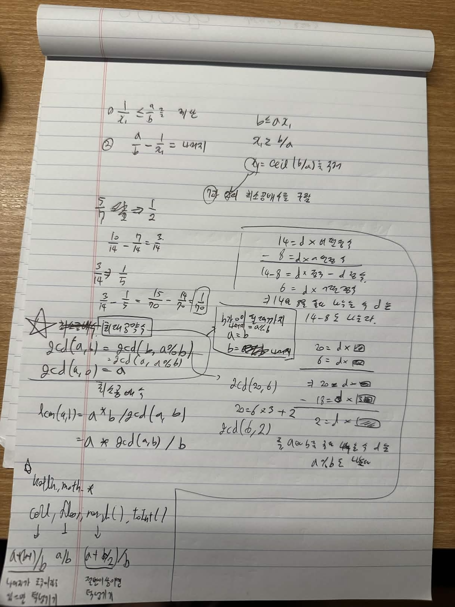

좋아. 처음부터 다시 정리하면 핵심은 이거다.

우리가 알고 싶은 건 왜 `gcd(a, b) = gcd(b, a % b)` 가 되는지다.
여기서 `%` 는 어려운 연산이 아니라, **b를 여러 번 빼고 마지막에 남는 값** 으로 이해하면 된다.

예를 들어 `20 % 6 = 2` 인 이유는 `20 = 6×3 + 2` 이기 때문이다.
이걸 공약수 관점으로 보면, 어떤 수 `d` 가 `20` 과 `6` 을 둘 다 나눈다면 `18 = 6×3` 도 당연히 나눈다.
그러면 `20 - 18 = 2` 도 `d` 로 나누어진다.
즉 **a와 b를 둘 다 나누는 수 d는 a%b도 반드시 나눈다** 는 사실이 나온다.

반대로 어떤 수 `d` 가 `b` 와 `a%b` 를 둘 다 나누면, `a = b×몫 + (a%b)` 이므로 `a` 도 나눈다.
그래서 `a와 b의 공약수 집합` 과 `b와 a%b의 공약수 집합` 이 완전히 같다.
공약수 집합이 같으니, 그중 가장 큰 수인 최대공약수도 같아서 `gcd(a, b) = gcd(b, a % b)` 가 된다.

---

# 처음부터 다시 정리

## 1. gcd가 뭔지

`gcd(a, b)` 는
**a와 b를 둘 다 나누는 수들 중 가장 큰 수**, 즉 최대공약수다.

예를 들어 `gcd(20, 6)` 을 구한다는 건
20과 6을 둘 다 나누는 가장 큰 수를 찾는다는 뜻이다.

---

## 2. `%` 가 뭔지

`a % b` 는
**a에서 b를 최대한 여러 번 빼고 마지막에 남는 값** 이다.

예를 들어

```text id="e3s1j7"
20 % 6 = 2
```

인 이유는

```text id="h63tkz"
20 = 6×3 + 2
```

이기 때문이다.

즉 20에서 6을 3번 빼면 2가 남는다.

---

## 3. 꼭 들어가야 하는 핵심 논리

이 부분이 제일 중요하다.

20과 6으로 생각해보면,

* `20 = d × 어떤정수`
* `6 = d × 어떤정수`

라고 하자.
즉 `d` 가 20과 6을 둘 다 나눈다고 하자.

그러면 `18 = 6×3` 도 당연히

```text id="2lfp1p"
18 = d × 어떤정수
```

꼴이다.

왜냐하면 6이 `d` 로 나누어지면, 그 3배인 18도 `d` 로 나누어지기 때문이다.

그러면

```text id="83a8ni"
20 - 18 = 2
```

이고,

```text id="8c6vcz"
2 = d × 어떤정수
```

가 된다.

즉 `d` 는 2도 나눈다.

여기서 2는 바로 `20 % 6` 이다.

그래서 결론은:

> **a, b를 둘 다 나누는 수 d는 a%b 도 나눈다.**

이게 유클리드 호제법의 절반이다.

---

## 4. 반대 방향도 필요함

위에서 우리는

* `d | a`
* `d | b`

이면

* `d | (a%b)`

라는 걸 봤다.

그런데 최대공약수가 정말 같다고 하려면 반대도 봐야 한다.

즉 어떤 수 `d` 가

* `b` 를 나누고
* `a%b` 도 나누면

`a` 도 나눠야 한다.

왜냐하면

```text id="8x4qgw"
a = b×몫 + (a%b)
```

이기 때문이다.

예를 들어

```text id="2hqlp5"
20 = 6×3 + 2
```

이다.

그래서 `d` 가 6과 2를 둘 다 나누면,
`6×3 + 2 = 20` 도 나눈다.

즉

> **b와 a%b를 둘 다 나누는 수는 a도 나눈다.**

---

## 5. 그래서 공약수 집합이 같다

정리하면

* `a와 b` 를 둘 다 나누는 수들은 `b와 a%b` 도 나누고
* `b와 a%b` 를 둘 다 나누는 수들은 `a와 b` 도 나눈다

즉 두 집합이 완전히 같다.

그래서

```text id="zbgshj"
gcd(a, b) = gcd(b, a % b)
```

가 된다.

---

# 더 쉽게 읽는 버전

## 한 줄 감각

큰 수 `a` 는

```text id="gzfunt"
a = b×몫 + 나머지
```

로 볼 수 있다.

그래서 `a와 b의 공약수` 를 찾는 문제는
결국 `b와 나머지의 공약수` 를 찾는 문제로 바꿔도 된다.

---

## 20과 6으로 다시 보면

### 원래 문제

```text id="54hbhy"
gcd(20, 6)
```

### 20을 6 기준으로 쪼개기

```text id="c5a0gc"
20 = 6×3 + 2
```

여기서 `2` 가 나머지다.

### 왜 2를 봐도 되냐

어떤 수 `d` 가 20과 6을 둘 다 나누면

* 20도 `d` 의 배수
* 6도 `d` 의 배수
* 그래서 18도 `d` 의 배수
* 그러면 `20 - 18 = 2` 도 `d` 의 배수

즉 20과 6의 공약수는 2도 반드시 나눈다.

반대로 `d` 가 6과 2를 둘 다 나누면

* `6×3` 도 나누고
* `6×3 + 2 = 20` 도 나눈다

즉 6과 2의 공약수는 20도 나눈다.

그래서

```text id="rsg4la"
gcd(20, 6) = gcd(6, 2)
```

이다.

---

# 헷갈리면 이렇게만 기억

## 꼭 기억할 문장 1

> a, b를 둘 다 나누는 수 d는 a%b도 나눈다.

## 꼭 기억할 문장 2

> b, a%b를 둘 다 나누는 수 d는 a도 나눈다.

## 최종 결론

> 그래서 `gcd(a, b) = gcd(b, a % b)` 이다.

---

# 코테용 짧은 정리

```text id="4ayhgc"
gcd(a, b) = gcd(b, r) = gcd(b, a%b)
```

이다.

---
