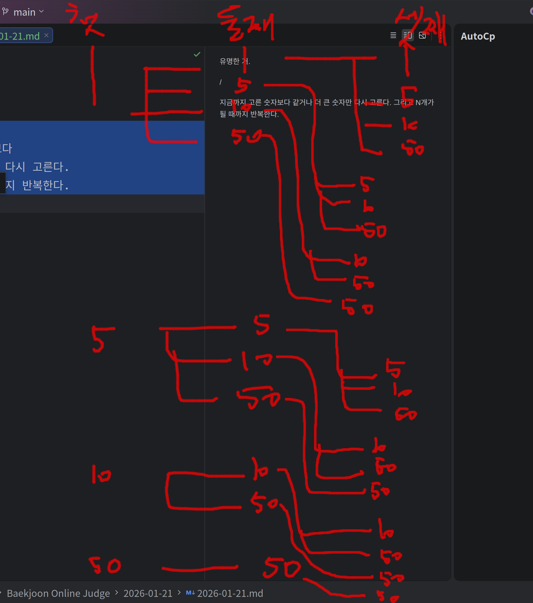

# 2026-01-21 재귀 완전 정복

## 핵심 아이디어

유명한 거임.



사람 말로 표현하면?
"지금까지 고른 숫자보다
같거나 더 큰 숫자만 다시 고른다.
그리고 N개가 될 때까지 반복한다."

## 재귀 인자의 의미

재귀의 인자란?
"작동 중에 관리되어야 하는 **상태**"
= 지금 이 시점에서 다음 판단을 하기 위해 **반드시** 알아야 하는 정보

지금 이 시점에서
내가 판단을 계속하려면
뭐를 반드시 알고 있어야 하지?

```kotlin
fun solve(count: Int, start: Int, sum: Int) {
    // count → 지금 몇 개 골랐는지
    // start → 다음에 어디서부터 고를 수 있는지
    // sum   → 지금까지 결과가 얼마인지
}
// 이 셋이 없으면 지금 상태를 설명할 수가 없다
```

## 재귀의 3요소

재귀 만드는 법?
"상태 + 종료조건 + 전이"
```
1. 인자로 상태를 정의하고
2. 종료조건을 표현하고
3. 다음 상태로 이동하는 걸 표현하면 된다
```

**재귀 = 상태 정의 + 종료 조건 + 상태 전이**

## DFS와 재귀의 공통점

DFS는 뭐하는 거?
"지금 정점에서
갈 수 있는 모든 다음 정점에 대해
똑같은 탐색을 다시 한다"

이 문제는?
"지금 상태에서
다음으로 고를 수 있는 모든 숫자에 대해
똑같은 선택 규칙을 다시 적용한다"

자기자신 호출의 의미?
"다음 선택지 각각에 대해 같은 판단을 다시 한다"

```
지금까지 고른 숫자보다
같거나 더 큰 숫자만 다시 고른다.
그리고 N개가 될 때까지 반복한다.
=> 이건 규칙 설명
```