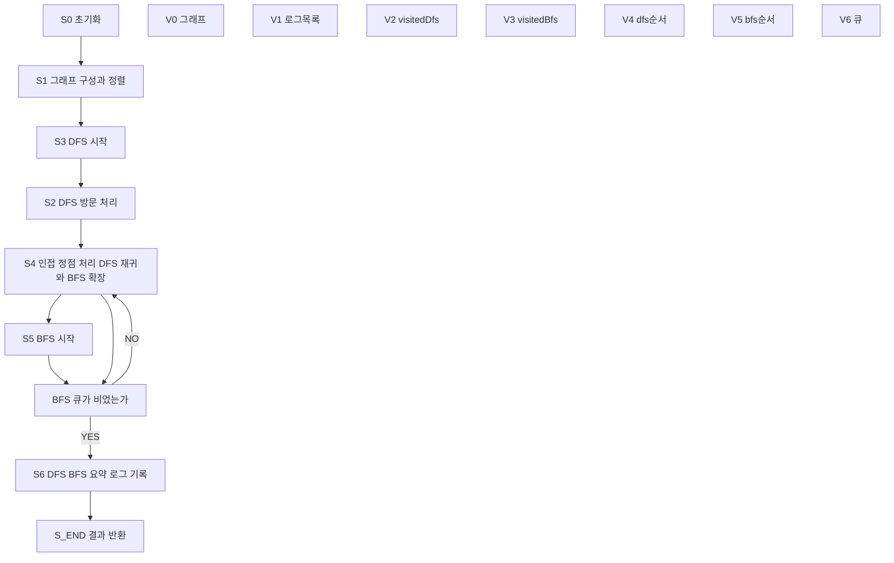

# DFS-BFS-로그 알고리즘 상태 전이 그래프

코드의 `[S]`, `[V]` 주석과 맞춘 버전이다.

```mermaid
graph TB
  S0["S0 초기화"]
  S1["S1 그래프 구성과 정렬"]
  S3["S3 DFS 시작"]
  S2["S2 DFS 방문 처리"]
  S4["S4 인접 정점 처리 DFS 재귀와 BFS 확장"]
  S5["S5 BFS 시작"]
  C1["BFS 큐가 비었는가"]
  S6["S6 DFS BFS 요약 로그 기록"]
  SEND["S_END 결과 반환"]

  S0 --> S1 --> S3 --> S2 --> S4 --> S5 --> C1
  C1 -- "NO" --> S4
  S4 --> C1
  C1 -- "YES" --> S6
  S6 --> SEND

  V0["V0 그래프"]
  V1["V1 로그목록"]
  V2["V2 visitedDfs"]
  V3["V3 visitedBfs"]
  V4["V4 dfs순서"]
  V5["V5 bfs순서"]
  V6["V6 큐"]
```

## V 상태
- `V0`: 그래프 인접 리스트
- `V1`: 로그 출력 배열
- `V2`: DFS visited
- `V3`: BFS visited
- `V4`: DFS 방문 순서
- `V5`: BFS 방문 순서
- `V6`: BFS 큐
