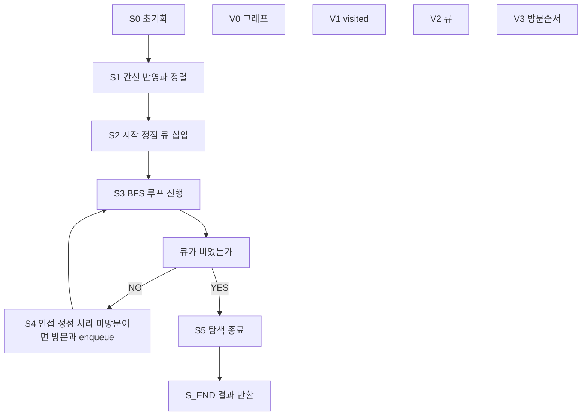

# bfs 알고리즘 상태 전이 그래프

코드의 `[S]`, `[V]` 주석과 맞춘 버전이다.

```mermaid
graph TB
  S0["S0 초기화"]
  S1["S1 간선 반영과 정렬"]
  S2["S2 시작 정점 큐 삽입"]
  S3["S3 BFS 루프 진행"]
  C1["큐가 비었는가"]
  S4["S4 인접 정점 처리 미방문이면 방문과 enqueue"]
  S5["S5 탐색 종료"]
  SEND["S_END 결과 반환"]

  S0 --> S1 --> S2 --> S3 --> C1
  C1 -- "NO" --> S4
  S4 --> S3
  C1 -- "YES" --> S5
  S5 --> SEND

  V0["V0 그래프"]
  V1["V1 visited"]
  V2["V2 큐"]
  V3["V3 방문순서"]
```

## V 상태
- `V0`: 그래프 인접 리스트
- `V1`: 방문 여부
- `V2`: BFS 큐
- `V3`: BFS 방문 순서 결과
