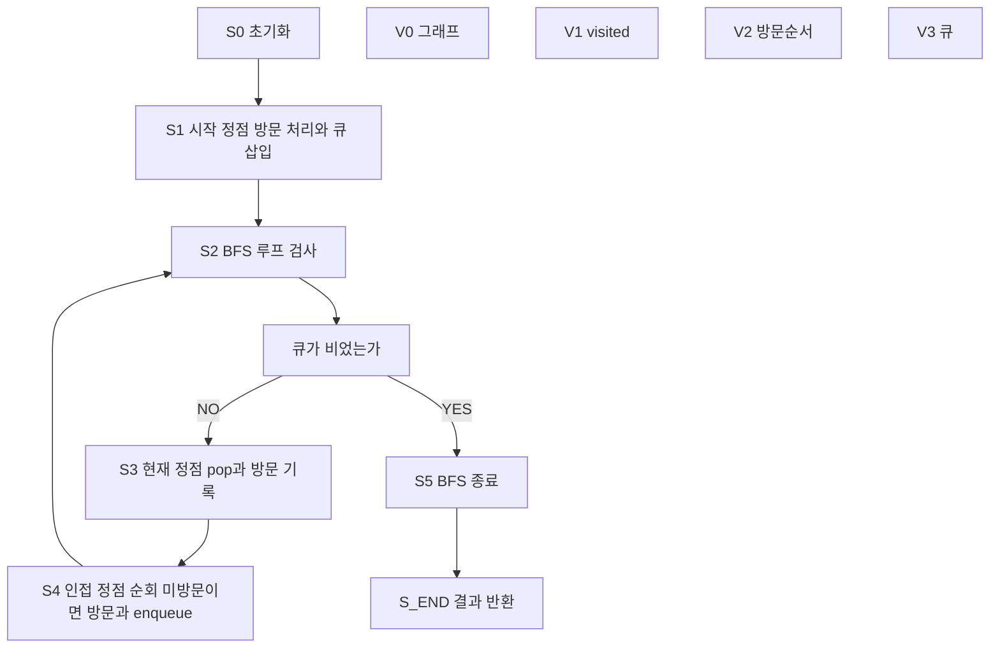

# dFS와BFS_BFS 알고리즘 상태 전이 그래프

코드의 `[S]`, `[V]` 주석과 맞춘 버전이다.

```mermaid
graph TB
  S0["S0 초기화"]
  S1["S1 시작 정점 방문 처리와 큐 삽입"]
  S2["S2 BFS 루프 검사"]
  C1["큐가 비었는가"]
  S3["S3 현재 정점 pop과 방문 기록"]
  S4["S4 인접 정점 순회 미방문이면 방문과 enqueue"]
  S5["S5 BFS 종료"]
  SEND["S_END 결과 반환"]

  S0 --> S1 --> S2 --> C1
  C1 -- "NO" --> S3
  S3 --> S4
  S4 --> S2
  C1 -- "YES" --> S5
  S5 --> SEND

  V0["V0 그래프"]
  V1["V1 visited"]
  V2["V2 방문순서"]
  V3["V3 큐"]
```

## V 상태
- `V0`: 그래프 인접 리스트
- `V1`: 정점 visited
- `V2`: BFS 방문 순서 결과
- `V3`: BFS 대기 큐
