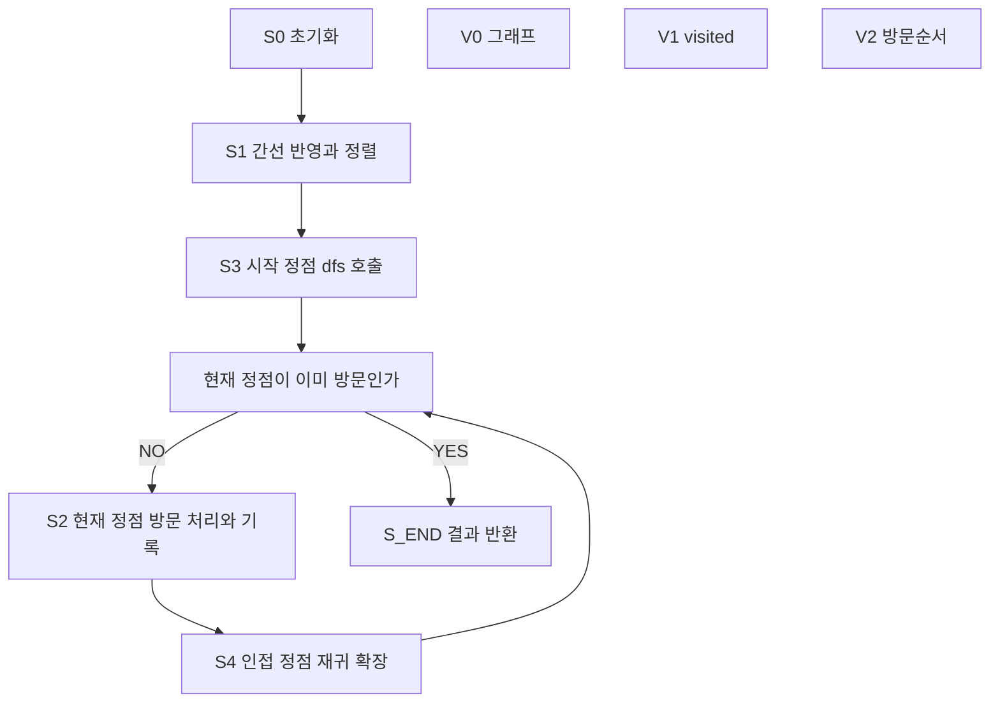

# dfs 알고리즘 상태 전이 그래프

코드의 `[S]`, `[V]` 주석과 맞춘 버전이다.

```mermaid
graph TB
  S0["S0 초기화"]
  S1["S1 간선 반영과 정렬"]
  S3["S3 시작 정점 dfs 호출"]
  C1["현재 정점이 이미 방문인가"]
  S2["S2 현재 정점 방문 처리와 기록"]
  S4["S4 인접 정점 재귀 확장"]
  SEND["S_END 결과 반환"]

  S0 --> S1 --> S3 --> C1
  C1 -- "YES" --> SEND
  C1 -- "NO" --> S2
  S2 --> S4
  S4 --> C1

  V0["V0 그래프"]
  V1["V1 visited"]
  V2["V2 방문순서"]
```

## V 상태
- `V0`: 그래프 인접 리스트
- `V1`: DFS visited
- `V2`: DFS 방문 순서 결과
