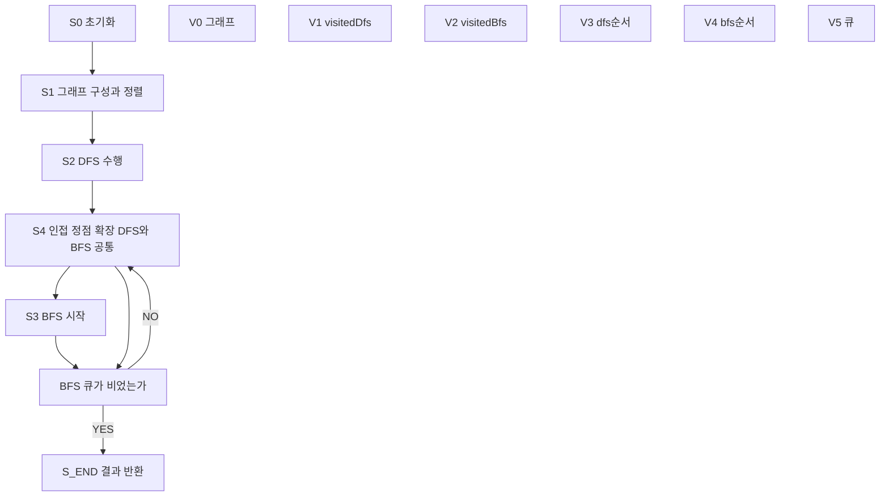

# dfsbfs 알고리즘 상태 전이 그래프

코드의 `[S]`, `[V]` 주석과 맞춘 버전이다.

```mermaid
graph TB
  S0["S0 초기화"]
  S1["S1 그래프 구성과 정렬"]
  S2["S2 DFS 수행"]
  S4["S4 인접 정점 확장 DFS와 BFS 공통"]
  S3["S3 BFS 시작"]
  C1["BFS 큐가 비었는가"]
  SEND["S_END 결과 반환"]

  S0 --> S1 --> S2 --> S4 --> S3 --> C1
  C1 -- "NO" --> S4
  S4 --> C1
  C1 -- "YES" --> SEND

  V0["V0 그래프"]
  V1["V1 visitedDfs"]
  V2["V2 visitedBfs"]
  V3["V3 dfs순서"]
  V4["V4 bfs순서"]
  V5["V5 큐"]
```

## V 상태
- `V0`: 그래프 인접 리스트
- `V1`: DFS visited
- `V2`: BFS visited
- `V3`: DFS 방문 순서
- `V4`: BFS 방문 순서
- `V5`: BFS 큐
