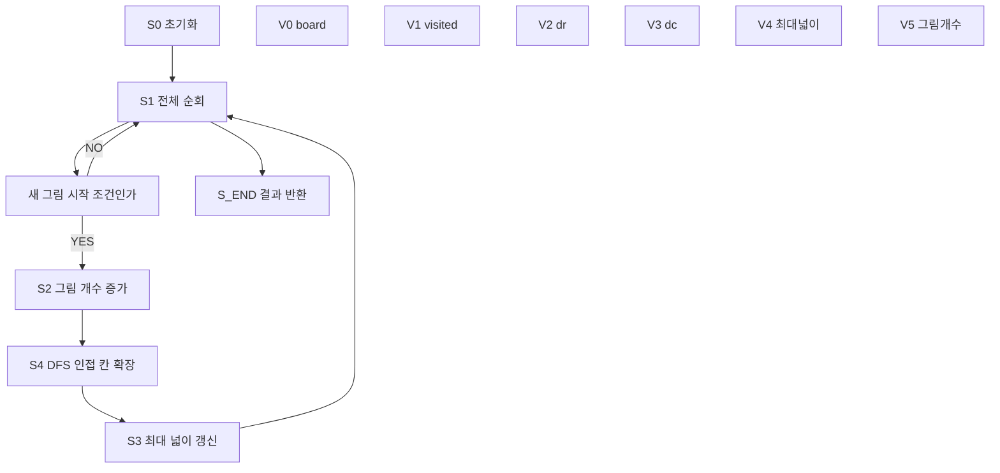

# 그림 알고리즘 상태 전이 그래프

코드의 `[S]`, `[V]` 주석과 맞춘 버전이다.

```mermaid
graph TB
  S0["S0 초기화"]
  S1["S1 전체 순회"]
  C1["새 그림 시작 조건인가"]
  S2["S2 그림 개수 증가"]
  S4["S4 DFS 인접 칸 확장"]
  S3["S3 최대 넓이 갱신"]
  SEND["S_END 결과 반환"]

  S0 --> S1 --> C1
  C1 -- "NO" --> S1
  C1 -- "YES" --> S2
  S2 --> S4
  S4 --> S3
  S3 --> S1
  S1 --> SEND

  V0["V0 board"]
  V1["V1 visited"]
  V2["V2 dr"]
  V3["V3 dc"]
  V4["V4 최대넓이"]
  V5["V5 그림개수"]
```

## V 상태
- `V0`: 그림 격자
- `V1`: visited
- `V2`: 세로 방향 벡터
- `V3`: 가로 방향 벡터
- `V4`: 최대 그림 넓이
- `V5`: 그림 개수
