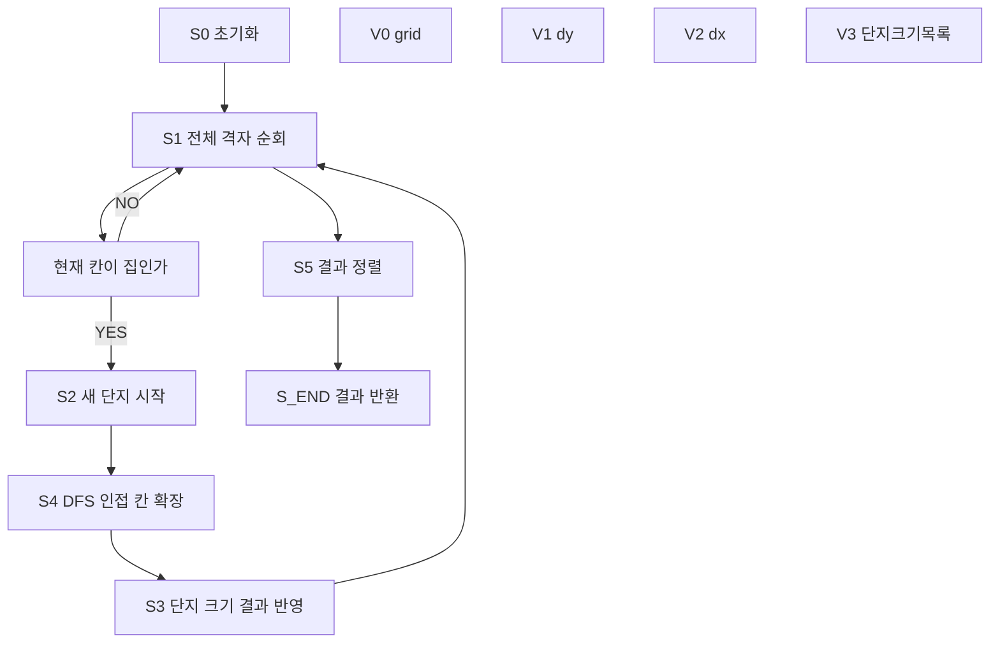

# 단지번호붙이기 알고리즘 상태 전이 그래프

코드의 `[S]`, `[V]` 주석과 맞춘 버전이다.

```mermaid
graph TB
  S0["S0 초기화"]
  S1["S1 전체 격자 순회"]
  C1["현재 칸이 집인가"]
  S2["S2 새 단지 시작"]
  S4["S4 DFS 인접 칸 확장"]
  S3["S3 단지 크기 결과 반영"]
  S5["S5 결과 정렬"]
  SEND["S_END 결과 반환"]

  S0 --> S1 --> C1
  C1 -- "NO" --> S1
  C1 -- "YES" --> S2
  S2 --> S4
  S4 --> S3
  S3 --> S1
  S1 --> S5 --> SEND

  V0["V0 grid"]
  V1["V1 dy"]
  V2["V2 dx"]
  V3["V3 단지크기목록"]
```

## V 상태
- `V0`: 지도 배열
- `V1`: 세로 방향 벡터
- `V2`: 가로 방향 벡터
- `V3`: 단지 크기 결과 목록
