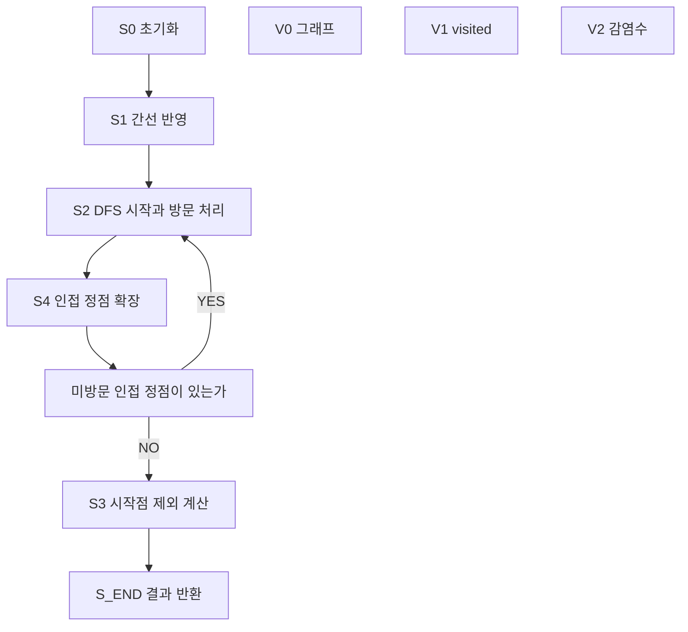

# 바이러스 알고리즘 상태 전이 그래프

코드의 `[S]`, `[V]` 주석과 맞춘 버전이다.

```mermaid
graph TB
  S0["S0 초기화"]
  S1["S1 간선 반영"]
  S2["S2 DFS 시작과 방문 처리"]
  S4["S4 인접 정점 확장"]
  C1["미방문 인접 정점이 있는가"]
  S3["S3 시작점 제외 계산"]
  SEND["S_END 결과 반환"]

  S0 --> S1 --> S2 --> S4 --> C1
  C1 -- "YES" --> S2
  C1 -- "NO" --> S3
  S3 --> SEND

  V0["V0 그래프"]
  V1["V1 visited"]
  V2["V2 감염수"]
```

## V 상태
- `V0`: 컴퓨터 연결 그래프
- `V1`: 방문 여부
- `V2`: 감염된 컴퓨터 수
