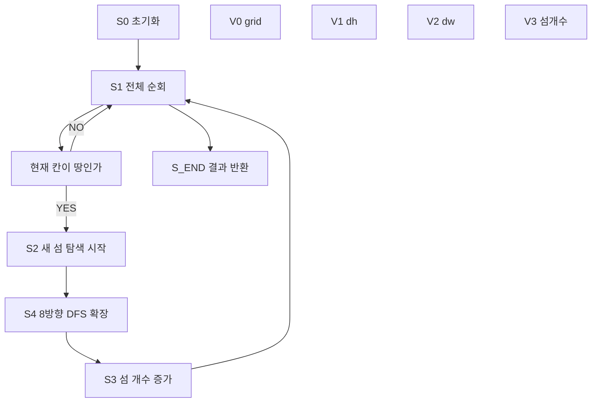

# 섬의_개수 알고리즘 상태 전이 그래프

코드의 `[S]`, `[V]` 주석과 맞춘 버전이다.

```mermaid
graph TB
  S0["S0 초기화"]
  S1["S1 전체 순회"]
  C1["현재 칸이 땅인가"]
  S2["S2 새 섬 탐색 시작"]
  S4["S4 8방향 DFS 확장"]
  S3["S3 섬 개수 증가"]
  SEND["S_END 결과 반환"]

  S0 --> S1 --> C1
  C1 -- "NO" --> S1
  C1 -- "YES" --> S2
  S2 --> S4
  S4 --> S3
  S3 --> S1
  S1 --> SEND

  V0["V0 grid"]
  V1["V1 dh"]
  V2["V2 dw"]
  V3["V3 섬개수"]
```

## V 상태
- `V0`: 지도 배열
- `V1`: 세로 8방향 벡터
- `V2`: 가로 8방향 벡터
- `V3`: 섬 개수
