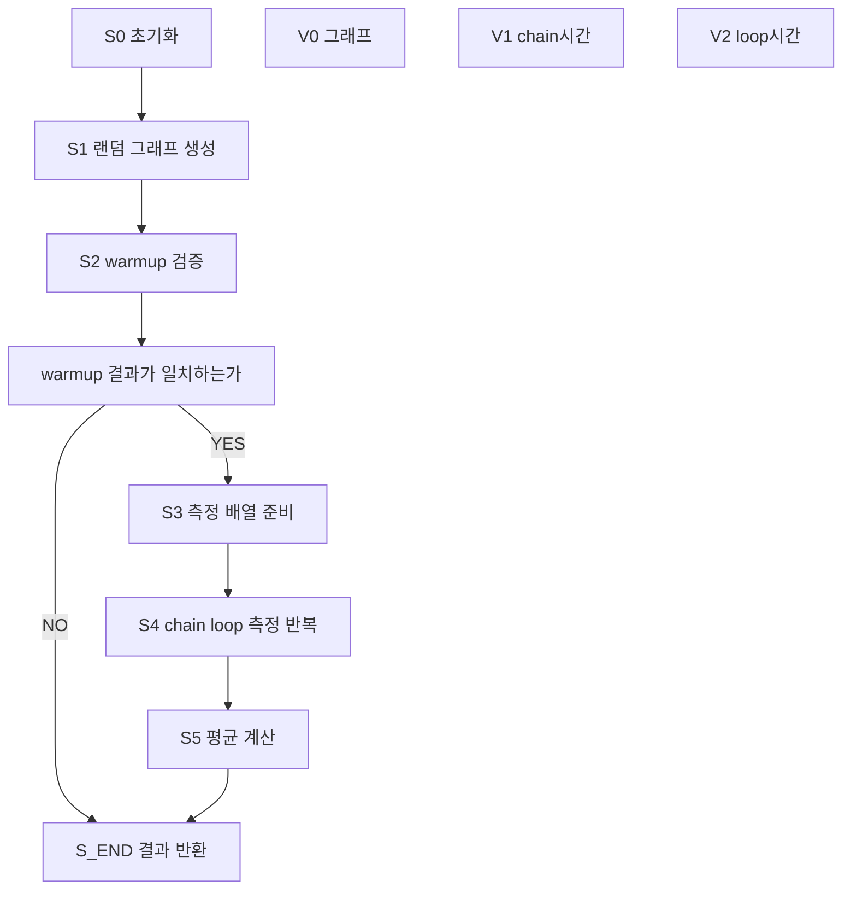

# 성능 알고리즘 상태 전이 그래프

코드의 `[S]`, `[V]` 주석과 맞춘 버전이다.

```mermaid
graph TB
  S0["S0 초기화"]
  S1["S1 랜덤 그래프 생성"]
  S2["S2 warmup 검증"]
  C1["warmup 결과가 일치하는가"]
  S3["S3 측정 배열 준비"]
  S4["S4 chain loop 측정 반복"]
  S5["S5 평균 계산"]
  SEND["S_END 결과 반환"]

  S0 --> S1 --> S2 --> C1
  C1 -- "NO" --> SEND
  C1 -- "YES" --> S3
  S3 --> S4
  S4 --> S5
  S5 --> SEND

  V0["V0 그래프"]
  V1["V1 chain시간"]
  V2["V2 loop시간"]
```

## V 상태
- `V0`: 생성된 그래프
- `V1`: chain 구현 측정값
- `V2`: loop 구현 측정값
