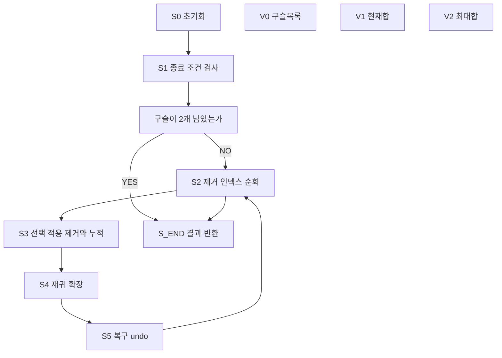

# 에너지모으기 알고리즘 상태 전이 그래프

코드의 `[S]`, `[V]` 주석과 맞춘 버전이다.

```mermaid
graph TB
  S0["S0 초기화"]
  S1["S1 종료 조건 검사"]
  C1["구슬이 2개 남았는가"]
  S2["S2 제거 인덱스 순회"]
  S3["S3 선택 적용 제거와 누적"]
  S4["S4 재귀 확장"]
  S5["S5 복구 undo"]
  SEND["S_END 결과 반환"]

  S0 --> S1 --> C1
  C1 -- "YES" --> SEND
  C1 -- "NO" --> S2
  S2 --> S3
  S3 --> S4
  S4 --> S5
  S5 --> S2
  S2 --> SEND

  V0["V0 구슬목록"]
  V1["V1 현재합"]
  V2["V2 최대합"]
```

## V 상태
- `V0`: 현재 구슬 상태
- `V1`: 현재 누적 에너지
- `V2`: 최대 에너지
