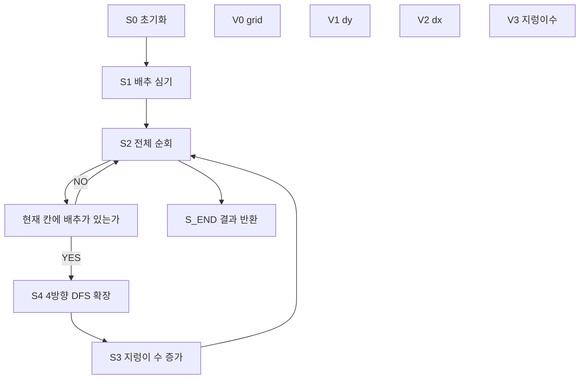

# 유기농_배추 알고리즘 상태 전이 그래프

코드의 `[S]`, `[V]` 주석과 맞춘 버전이다.

```mermaid
graph TB
  S0["S0 초기화"]
  S1["S1 배추 심기"]
  S2["S2 전체 순회"]
  C1["현재 칸에 배추가 있는가"]
  S4["S4 4방향 DFS 확장"]
  S3["S3 지렁이 수 증가"]
  SEND["S_END 결과 반환"]

  S0 --> S1 --> S2 --> C1
  C1 -- "NO" --> S2
  C1 -- "YES" --> S4
  S4 --> S3
  S3 --> S2
  S2 --> SEND

  V0["V0 grid"]
  V1["V1 dy"]
  V2["V2 dx"]
  V3["V3 지렁이수"]
```

## V 상태
- `V0`: 배추 격자
- `V1`: 세로 방향 벡터
- `V2`: 가로 방향 벡터
- `V3`: 필요한 지렁이 수
