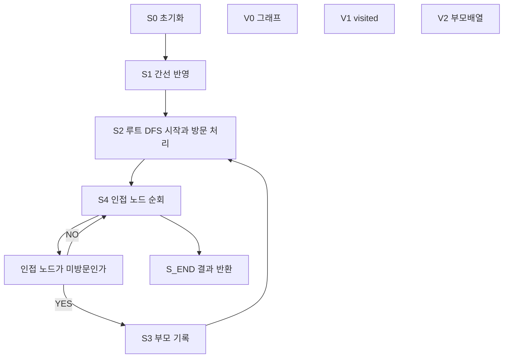

# 트리의_부모_찾기 알고리즘 상태 전이 그래프

코드의 `[S]`, `[V]` 주석과 맞춘 버전이다.

```mermaid
graph TB
  S0["S0 초기화"]
  S1["S1 간선 반영"]
  S2["S2 루트 DFS 시작과 방문 처리"]
  S4["S4 인접 노드 순회"]
  C1["인접 노드가 미방문인가"]
  S3["S3 부모 기록"]
  SEND["S_END 결과 반환"]

  S0 --> S1 --> S2 --> S4 --> C1
  C1 -- "NO" --> S4
  C1 -- "YES" --> S3
  S3 --> S2
  S4 --> SEND

  V0["V0 그래프"]
  V1["V1 visited"]
  V2["V2 부모배열"]
```

## V 상태
- `V0`: 트리 인접 리스트
- `V1`: 방문 여부
- `V2`: 노드별 부모
