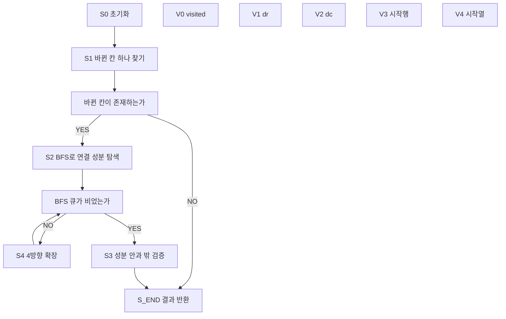

# 항체인식 알고리즘 상태 전이 그래프

코드의 `[S]`, `[V]` 주석과 맞춘 버전이다.

```mermaid
graph TB
  S0["S0 초기화"]
  S1["S1 바뀐 칸 하나 찾기"]
  C1["바뀐 칸이 존재하는가"]
  S2["S2 BFS로 연결 성분 탐색"]
  C2["BFS 큐가 비었는가"]
  S4["S4 4방향 확장"]
  S3["S3 성분 안과 밖 검증"]
  SEND["S_END 결과 반환"]

  S0 --> S1 --> C1
  C1 -- "NO" --> SEND
  C1 -- "YES" --> S2
  S2 --> C2
  C2 -- "NO" --> S4
  S4 --> C2
  C2 -- "YES" --> S3
  S3 --> SEND

  V0["V0 visited"]
  V1["V1 dr"]
  V2["V2 dc"]
  V3["V3 시작행"]
  V4["V4 시작열"]
```

## V 상태
- `V0`: 연결 성분 visited
- `V1`: 세로 방향 벡터
- `V2`: 가로 방향 벡터
- `V3`: 시작 행 좌표
- `V4`: 시작 열 좌표
