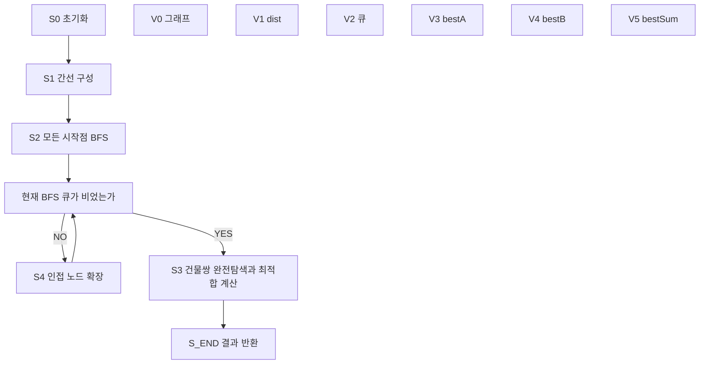

# 호석이두마리치킨 알고리즘 상태 전이 그래프

코드의 `[S]`, `[V]` 주석과 맞춘 버전이다.

```mermaid
graph TB
  S0["S0 초기화"]
  S1["S1 간선 구성"]
  S2["S2 모든 시작점 BFS"]
  C1["현재 BFS 큐가 비었는가"]
  S4["S4 인접 노드 확장"]
  S3["S3 건물쌍 완전탐색과 최적합 계산"]
  SEND["S_END 결과 반환"]

  S0 --> S1 --> S2 --> C1
  C1 -- "NO" --> S4
  S4 --> C1
  C1 -- "YES" --> S3
  S3 --> SEND

  V0["V0 그래프"]
  V1["V1 dist"]
  V2["V2 큐"]
  V3["V3 bestA"]
  V4["V4 bestB"]
  V5["V5 bestSum"]
```

## V 상태
- `V0`: 건물 그래프
- `V1`: 최단거리 테이블
- `V2`: BFS 큐
- `V3`: 최적 첫 번째 건물
- `V4`: 최적 두 번째 건물
- `V5`: 최소 왕복 합
