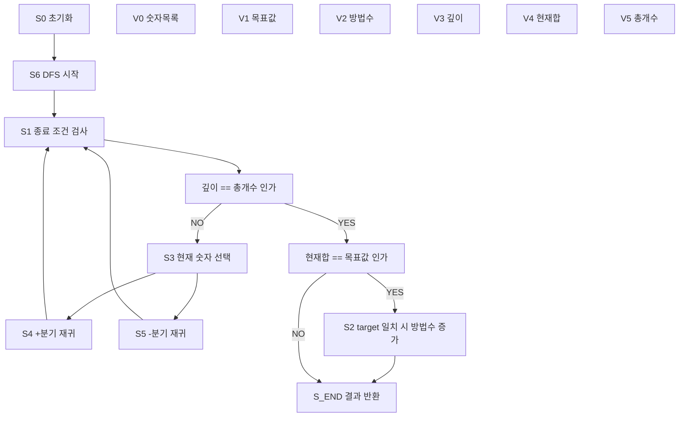

# 타겟넘버 알고리즘 상태 전이 그래프

코드의 `[S]`, `[V]` 주석과 맞춘 버전이다.

```mermaid
graph TB
  S0["S0 초기화"]
  S6["S6 DFS 시작"]
  S1["S1 종료 조건 검사"]
  C1["깊이 == 총개수 인가"]
  S3["S3 현재 숫자 선택"]
  S4["S4 +분기 재귀"]
  S5["S5 -분기 재귀"]
  S2["S2 target 일치 시 방법수 증가"]
  C2["현재합 == 목표값 인가"]
  SEND["S_END 결과 반환"]

  S0 --> S6
  S6 --> S1
  S1 --> C1

  C1 -- "NO" --> S3
  S3 --> S4
  S4 --> S1
  S3 --> S5
  S5 --> S1

  C1 -- "YES" --> C2
  C2 -- "YES" --> S2
  S2 --> SEND
  C2 -- "NO" --> SEND

  V0["V0 숫자목록"]
  V1["V1 목표값"]
  V2["V2 방법수"]
  V3["V3 깊이"]
  V4["V4 현재합"]
  V5["V5 총개수"]
```

## V 상태
- `V0`: 입력 숫자 배열
- `V1`: target 값
- `V2`: 정답 카운트
- `V3`: 현재 재귀 깊이(index)
- `V4`: 현재 누적합
- `V5`: 숫자 총 개수
