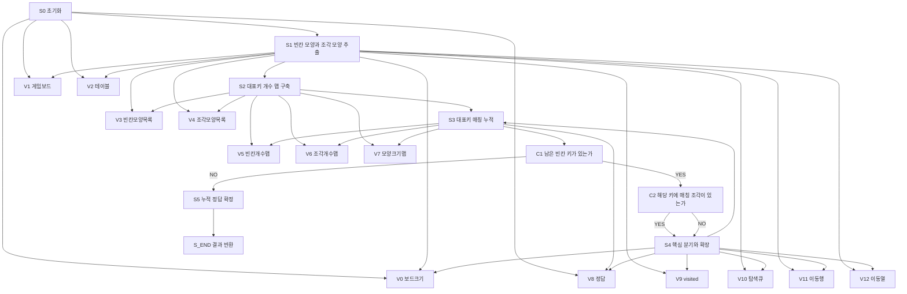

# 퍼즐 조각 채우기 스키마 모델링

코드의 `[S*]`, `[V*]` 집합과 실행 순서를 맞춘 버전이다.

```mermaid
graph TB
  A1["S0 초기화"]
  A2["S1 빈칸 모양과 조각 모양 추출"]
  A3["S2 대표키 개수 맵 구축"]
  A4["S3 대표키 매칭 누적"]
  A5["S4 핵심 분기와 확장"]
  C1["C1 남은 빈칸 키가 있는가"]
  C2["C2 해당 키에 매칭 조각이 있는가"]
  A6["S5 누적 정답 확정"]
  A7["S_END 결과 반환"]

  B1["V0 보드크기"]
  B2["V1 게임보드"]
  B3["V2 테이블"]
  B4["V3 빈칸모양목록"]
  B5["V4 조각모양목록"]
  B6["V5 빈칸개수맵"]
  B7["V6 조각개수맵"]
  B8["V7 모양크기맵"]
  B9["V8 정답"]
  B10["V9 visited"]
  B11["V10 탐색큐"]
  B12["V11 이동행"]
  B13["V12 이동열"]

  A1 --> A2
  A2 --> A3
  A3 --> A4
  A4 --> C1
  C1 -- "YES" --> C2
  C1 -- "NO" --> A6
  C2 -- "YES" --> A5
  C2 -- "NO" --> A5
  A5 --> A4
  A6 --> A7

  A1 --> B1
  A1 --> B2
  A1 --> B3
  A1 --> B9
  A2 --> B1
  A2 --> B2
  A2 --> B3
  A2 --> B4
  A2 --> B5
  A2 --> B10
  A2 --> B11
  A2 --> B12
  A2 --> B13
  A3 --> B4
  A3 --> B5
  A3 --> B6
  A3 --> B7
  A3 --> B8
  A4 --> B6
  A4 --> B7
  A4 --> B8
  A4 --> B9
  A5 --> B1
  A5 --> B9
  A5 --> B10
  A5 --> B11
  A5 --> B12
  A5 --> B13
```

## S/V 싱크 체크 결과
- S 집합: `S0,S1,S2,S3,S4,S5,S_END` 코드/스키마 일치
- V 집합: `V0,V1,V2,V3,V4,V5,V6,V7,V8,V9,V10,V11,V12` 코드/스키마 일치
