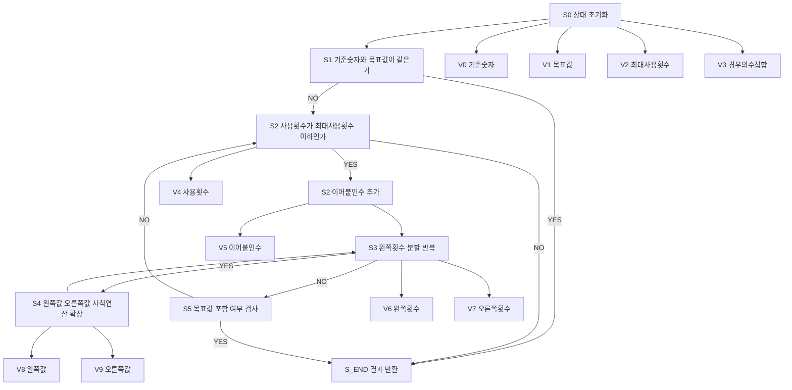

# N으로 표현 스키마 모델링

```mermaid
graph TB
  A1["S0 상태 초기화"]
  A2["S1 기준숫자와 목표값이 같은가"]
  A3["S2 사용횟수가 최대사용횟수 이하인가"]
  A4["S2 이어붙인수 추가"]
  A5["S3 왼쪽횟수 분할 반복"]
  A6["S4 왼쪽값 오른쪽값 사칙연산 확장"]
  A7["S5 목표값 포함 여부 검사"]
  A8["S_END 결과 반환"]

  B1["V0 기준숫자"]
  B2["V1 목표값"]
  B3["V2 최대사용횟수"]
  B4["V3 경우의수집합"]
  B5["V4 사용횟수"]
  B6["V5 이어붙인수"]
  B7["V6 왼쪽횟수"]
  B8["V7 오른쪽횟수"]
  B9["V8 왼쪽값"]
  B10["V9 오른쪽값"]

  A1 --> A2
  A2 -- "YES" --> A8
  A2 -- "NO" --> A3
  A3 -- "YES" --> A4
  A3 -- "NO" --> A8
  A4 --> A5
  A5 -- "YES" --> A6
  A5 -- "NO" --> A7
  A6 --> A5
  A7 -- "YES" --> A8
  A7 -- "NO" --> A3

  A1 --> B1
  A1 --> B2
  A1 --> B3
  A1 --> B4
  A3 --> B5
  A4 --> B6
  A5 --> B7
  A5 --> B8
  A6 --> B9
  A6 --> B10
```

## S/V 싱크 체크 결과
- S 집합: `S0,S1,S2,S3,S4,S5,S_END` 코드/스키마 일치
- V 집합: `V0,V1,V2,V3,V4,V5,V6,V7,V8,V9` 코드/스키마 일치
