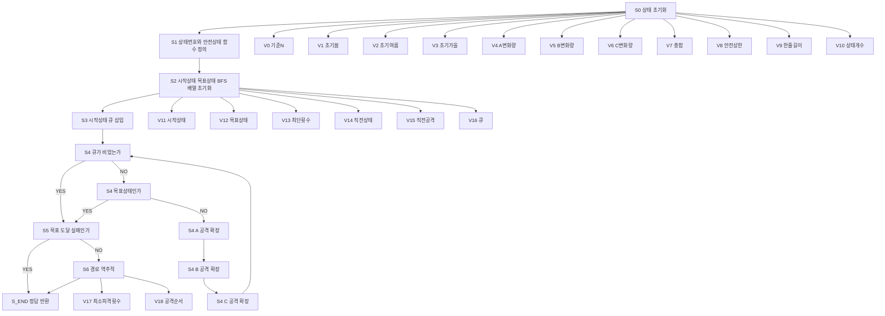

# 사계절을 되찾은 자 스키마 모델링

```mermaid
graph TB
  A1["S0 상태 초기화"]
  A2["S1 상태번호와 안전상태 함수 정의"]
  A3["S2 시작상태 목표상태 BFS 배열 초기화"]
  A4["S3 시작상태 큐 삽입"]
  A5["S4 큐가 비었는가"]
  A6["S4 목표상태인가"]
  A7["S4 A 공격 확장"]
  A8["S4 B 공격 확장"]
  A9["S4 C 공격 확장"]
  A10["S5 목표 도달 실패인가"]
  A11["S6 경로 역추적"]
  A12["S_END 정답 반환"]

  B1["V0 기준N"]
  B2["V1 초기봄"]
  B3["V2 초기여름"]
  B4["V3 초기가을"]
  B5["V4 A변화량"]
  B6["V5 B변화량"]
  B7["V6 C변화량"]
  B8["V7 총합"]
  B9["V8 안전상한"]
  B10["V9 한줄길이"]
  B11["V10 상태개수"]
  B12["V11 시작상태"]
  B13["V12 목표상태"]
  B14["V13 최단횟수"]
  B15["V14 직전상태"]
  B16["V15 직전공격"]
  B17["V16 큐"]
  B18["V17 최소피격횟수"]
  B19["V18 공격순서"]

  A1 --> A2
  A2 --> A3
  A3 --> A4
  A4 --> A5
  A5 -- "YES" --> A10
  A5 -- "NO" --> A6
  A6 -- "YES" --> A10
  A6 -- "NO" --> A7
  A7 --> A8
  A8 --> A9
  A9 --> A5
  A10 -- "YES" --> A12
  A10 -- "NO" --> A11
  A11 --> A12

  A1 --> B1
  A1 --> B2
  A1 --> B3
  A1 --> B4
  A1 --> B5
  A1 --> B6
  A1 --> B7
  A1 --> B8
  A1 --> B9
  A1 --> B10
  A1 --> B11
  A3 --> B12
  A3 --> B13
  A3 --> B14
  A3 --> B15
  A3 --> B16
  A3 --> B17
  A11 --> B18
  A11 --> B19
```

## S/V 싱크 체크 결과
- S 집합: `S0,S1,S2,S3,S4,S5,S6,S_END` 코드/스키마 일치
- V 집합: `V0,V1,V2,V3,V4,V5,V6,V7,V8,V9,V10,V11,V12,V13,V14,V15,V16,V17,V18` 코드/스키마 일치
