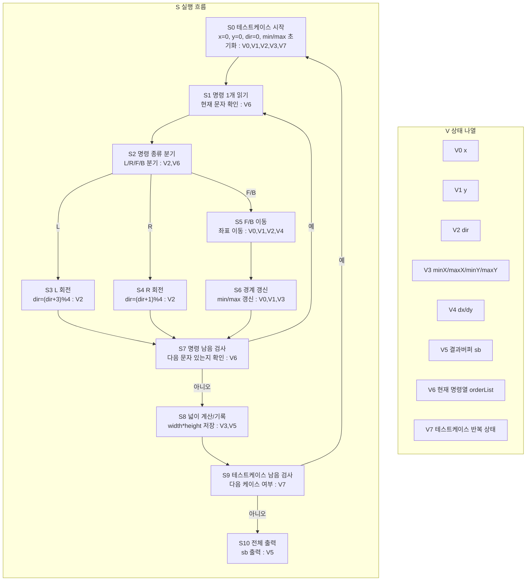

# 거북이 알고리즘 상태 전이 그래프

한 다이어그램 안에서 `S`(흐름)와 `V`(상태)를 분리해서 본다.

## 1) 통합 다이어그램 (S+V)

## 2) V 갱신 규칙 (S 단계 기준)

- `S0`: `V0,V1,V2,V3,V7` 초기화
- `S3,S4`: `V2` 회전 갱신
- `S5`: `V0,V1` 이동 갱신
- `S6`: `V3` 경계 갱신
- `S8`: `V5`에 케이스 결과 추가
- `S10`: `V5` 최종 출력

## 직관 요약

흐름은 `명령 재생 -> 좌표/경계 갱신 -> 넓이 기록`을 케이스마다 반복하고,
상태 관리는 `V0~V7` 정의표와 갱신 규칙표로 추적한다.
