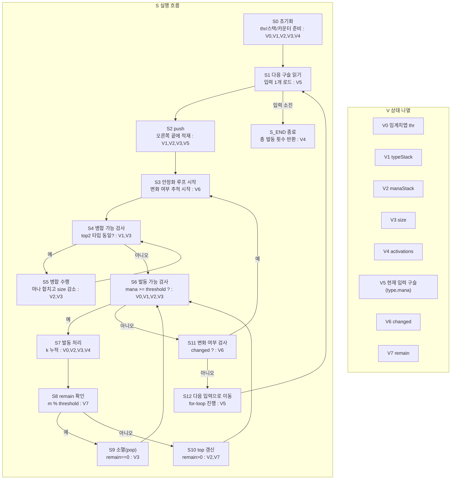

# 구슬 연쇄 발동 알고리즘 상태 전이 그래프

한 다이어그램 안에서 `S`(흐름)와 `V`(상태)를 분리해서 본다.

## 1) 통합 다이어그램 (S+V)

## 2) V 갱신 규칙 (S 단계 기준)

- `S0`: `V0,V1,V2,V3,V4` 초기화
- `S2`: `V1,V2,V3` push 반영
- `S5`: `V2,V3` 병합 반영
- `S7`: `V4` 발동 횟수 누적
- `S9,S10`: `V3` 소멸 또는 `V2` 잔여 마나 반영

## 직관 요약

흐름은 `push -> 병합 연쇄 -> 발동/소멸 연쇄 -> 안정화`를 반복하고,
상태 관리는 `V0~V7` 정의표와 갱신 규칙표로 추적한다.
