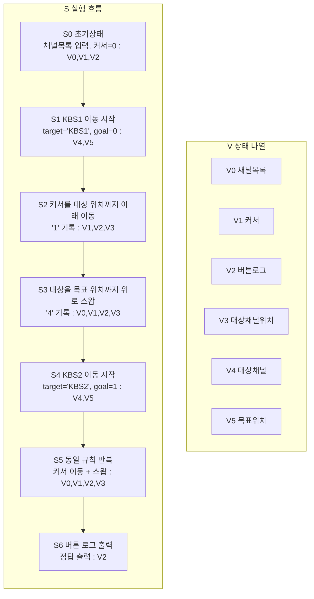

# 디지털티비 알고리즘 상태 전이 그래프

한 다이어그램 안에서 `S`(흐름)와 `V`(상태)를 분리해서 본다.

## 1) 통합 다이어그램 (S+V)

## 2) V 갱신 규칙 (S 단계 기준)

- `S0`: `V0,V1,V2` 초기화
- `S2,S5`: `V1,V2,V3` 갱신
- `S3,S5`: `V0` 스왑 갱신
- `S6`: `V2` 출력

## 직관 요약

흐름은 `대상 찾기 -> 위로 끌어올리기`를 KBS1, KBS2 순서로 반복하고,
상태 관리는 `V0~V5` 정의표와 갱신 규칙표로 추적한다.
