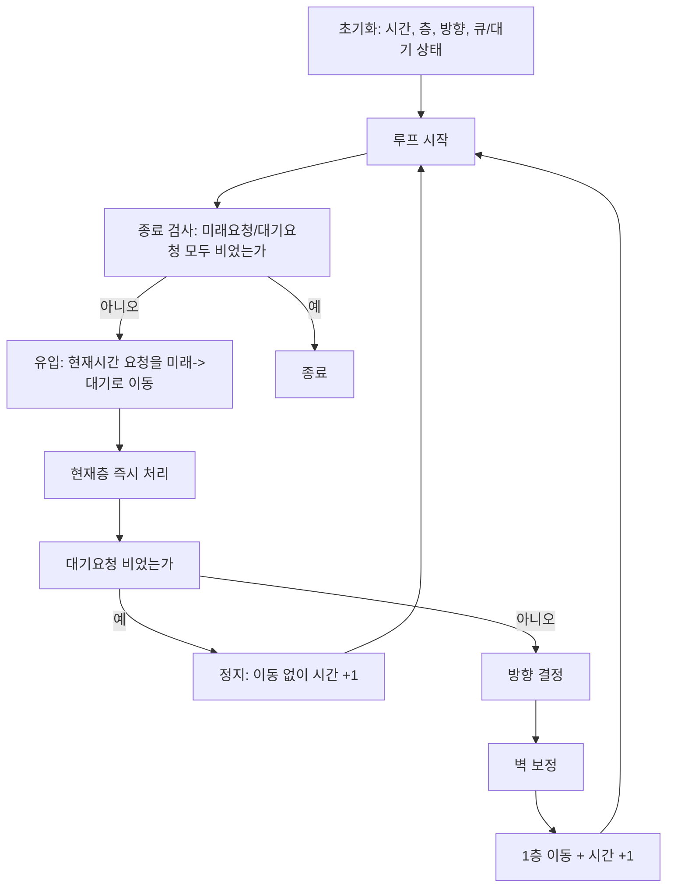
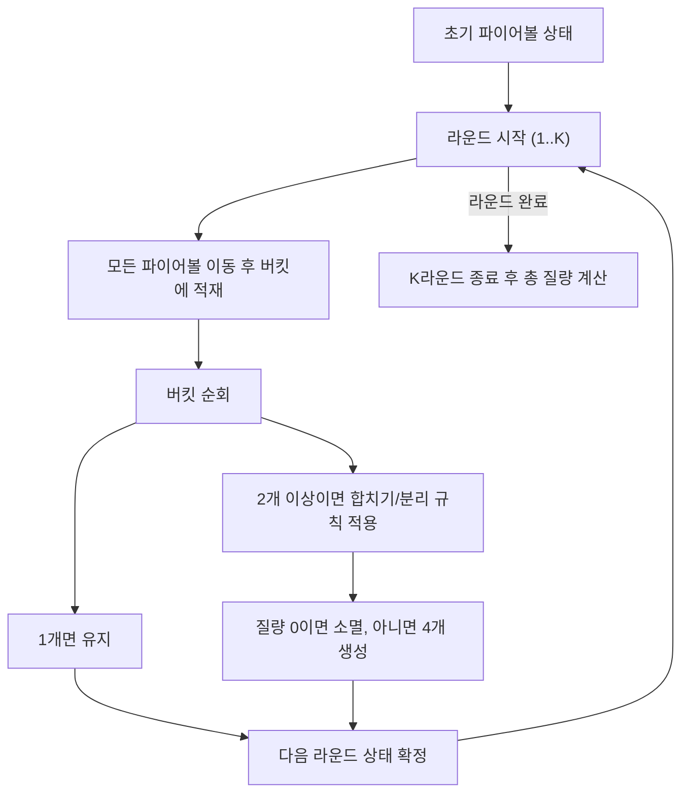
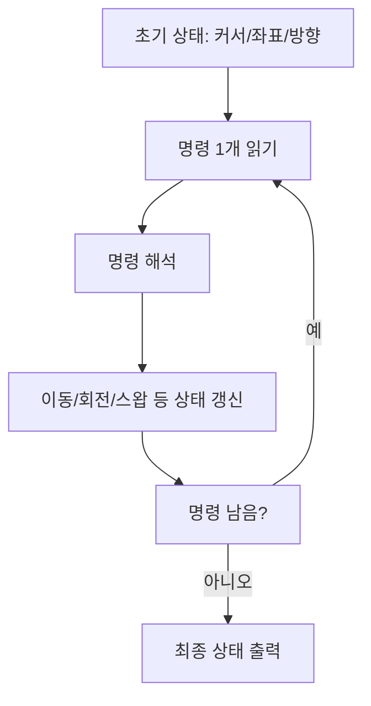
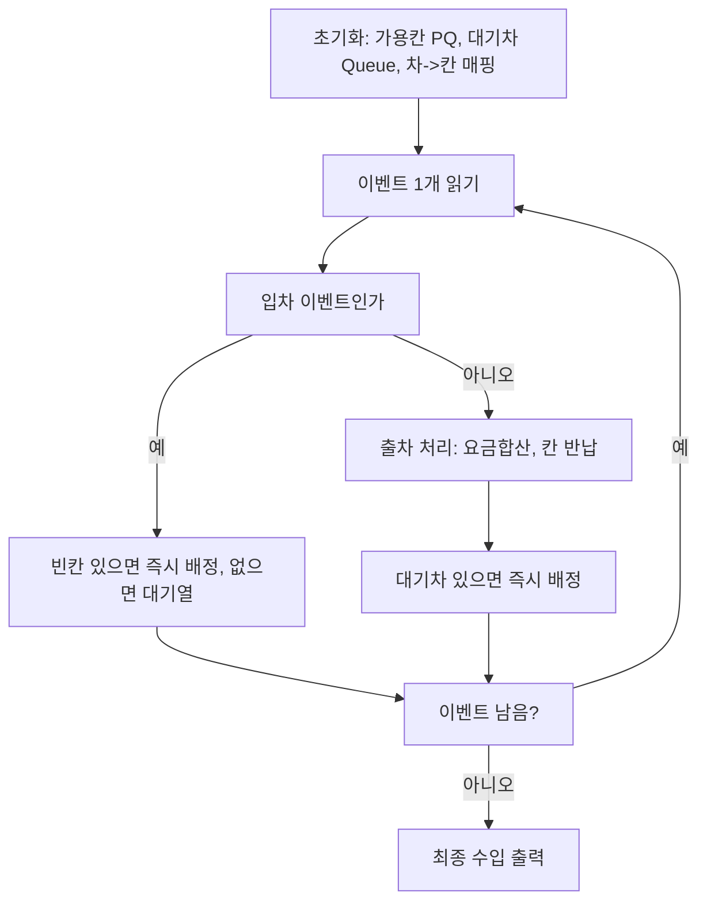
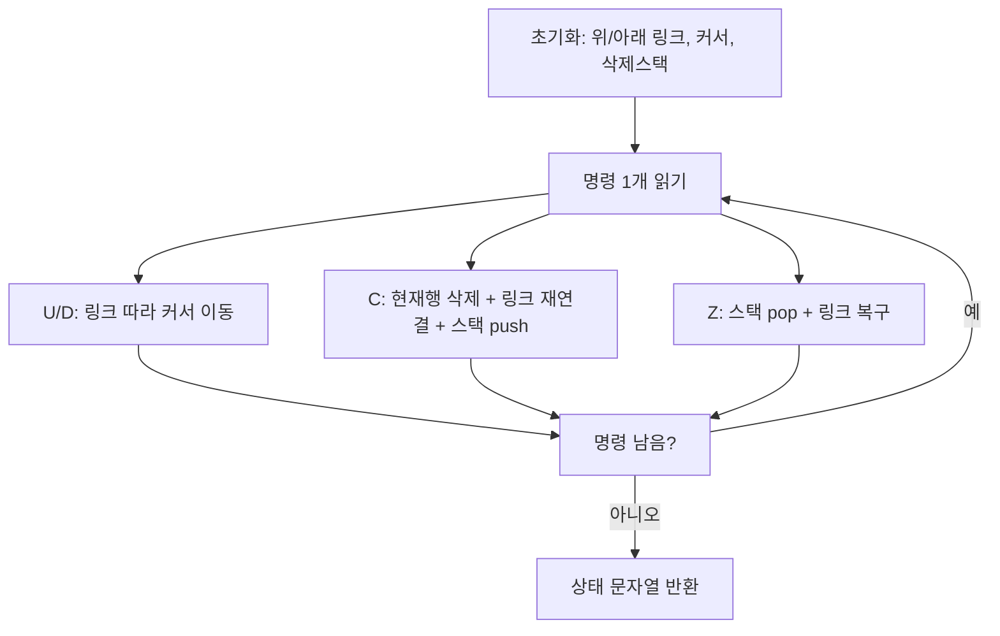
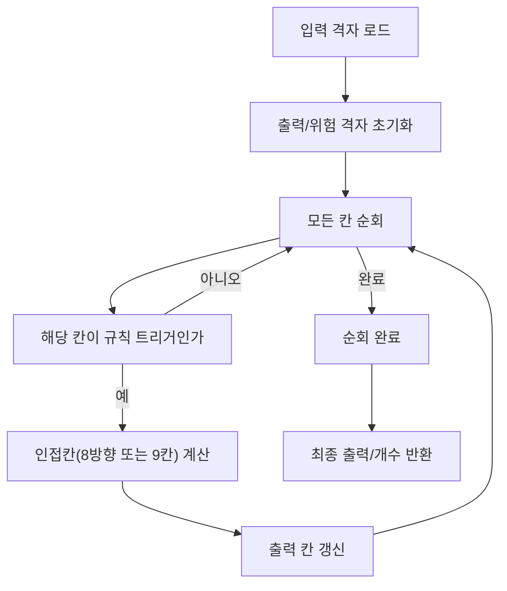
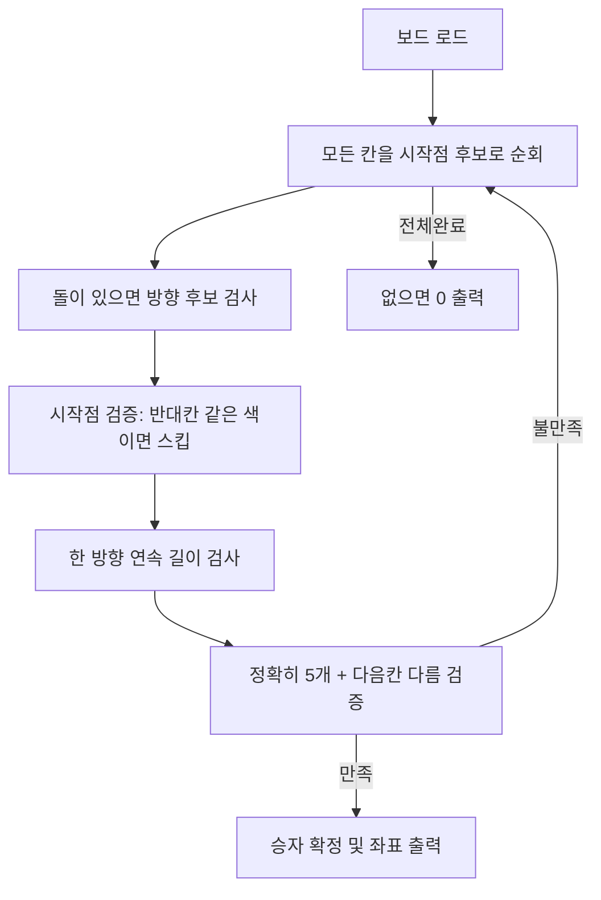

# 시뮬레이션 유형별 스키마 모델링

## 결론

아래 9개 문제는 모두 모델링 가능하다.
- 엘레베이터
- 파이어볼
- 거북이
- 디지털티비
- 주차장
- 표편집
- 지뢰찾기
- 안전지대
- 오목

단, 뼈대는 하나로 고정하지 않고 유형별로 나눠야 읽기 쉽고 재사용이 된다.

## 문제 유형 분리 정책

| 유형 | 핵심 상태축 | 반복 골격 | 해당 문제 |
|---|---|---|---|
| 시간축 이벤트 | 시간, 미래요청, 대기요청, 시스템상태 | 종료검사 -> 유입 -> 처리 -> 분기 -> 이동/시간증가 | 엘레베이터 |
| 라운드 동시갱신 | 라운드, 현재상태, 다음버킷 | 이동 -> 집계 -> 합치기/분리 -> 확정 | 파이어볼 |
| 명령 재생 | 명령포인터, 커서/좌표, 방향 | 명령읽기 -> 규칙적용 -> 상태갱신 | 거북이, 디지털티비 |
| 자원할당 큐 | 이벤트스트림, 가용자원, 대기큐 | 이벤트처리 -> 자원할당/회수 -> 대기해소 | 주차장 |
| 링크구조 편집 | 위/아래 링크, 커서, 삭제스택 | 명령처리 -> 링크재연결 | 표편집 |
| 격자 로컬규칙 | 입력격자, 출력격자, 인접방향 | 전체순회 -> 인접계산 -> 출력반영 | 지뢰찾기, 안전지대 |
| 패턴 스캔 | 보드, 스캔포인터, 방향벡터 | 후보탐색 -> 연속검사 -> 양끝검증 | 오목 |

---

## 문제별 모델 카드 (S/E/T)

아래는 각 문제를 상태(State) / 이벤트(Event) / 전이(Transition)로 바로 적용한 카드다.

| 문제 | 유형 | 상태 S | 이벤트 E | 전이 T |
|---|---|---|---|---|
| 엘레베이터 | 시간축 이벤트 | `현재시간, 현재층, 방향, 요구큐, 대기중인층` | `시간도달, 현재층도착, 벽도달` | `미래->대기`, `대기->처리`, `방향전환/유지`, `이동` |
| 파이어볼 | 라운드 동시갱신 | `fireballs, buckets, round` | `라운드시작, 셀집계` | `이동`, `합치기`, `분리`, `소멸` |
| 거북이 | 명령 재생 | `x,y,dir,min/max` | `명령 L/R/F/B` | `회전`, `전진/후진`, `경계박스 갱신` |
| 디지털티비 | 명령 재생 | `채널리스트, 커서, 출력버튼로그` | `목표채널 탐색/스왑` | `커서이동`, `스왑`, `버튼기록` |
| 주차장 | 자원할당 큐 | `빈칸PQ, 대기차Q, 차->칸 매핑, 수입` | `입차, 출차` | `즉시배정/대기`, `반납`, `대기해소`, `요금누적` |
| 표편집 | 링크구조 편집 | `위/아래 링크, 커서, 삭제스택, 상태문자열` | `U,D,C,Z` | `커서이동`, `삭제/연결`, `복구/연결` |
| 지뢰찾기 | 격자 로컬규칙 | `mineMap, openMap, output` | `칸열기, 폭발여부` | `8방향 카운트`, `폭발시 지뢰 공개` |
| 안전지대 | 격자 로컬규칙 | `board, danger` | `지뢰칸 발견` | `주변 9칸 위험표시`, `안전칸 카운트` |
| 오목 | 패턴 스캔 | `board, 방향벡터, 후보좌표` | `돌칸 발견` | `시작점검증`, `연속5검사`, `양끝검증` |

---

## 1) 시간축 이벤트 뼈대 (엘레베이터)

---

## 2) 라운드 동시갱신 뼈대 (파이어볼)

---

## 3) 명령 재생 뼈대 (거북이, 디지털티비)

---

## 4) 자원할당 큐 뼈대 (주차장)

---

## 5) 링크구조 편집 뼈대 (표편집)

---

## 6) 격자 로컬규칙 뼈대 (지뢰찾기, 안전지대)

---

## 7) 패턴 스캔 뼈대 (오목)

