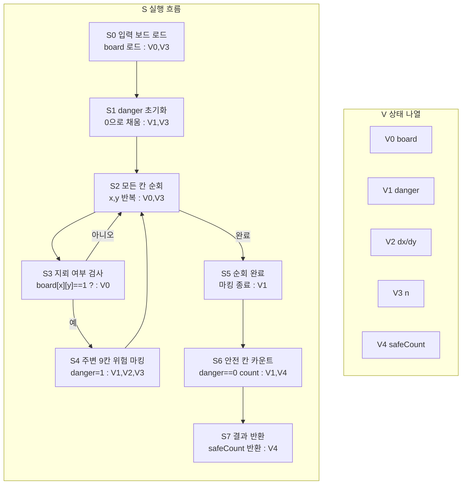

# 안전지대 알고리즘 상태 전이 그래프

한 다이어그램 안에서 `S`(흐름)와 `V`(상태)를 분리해서 본다.

## 1) 통합 다이어그램 (S+V)

## 2) V 갱신 규칙 (S 단계 기준)

- `S1`: `V1` 초기화
- `S4`: `V1` 위험 마킹
- `S6`: `V4` 안전 칸 카운트
- `S7`: `V4` 반환

## 직관 요약

흐름은 `위험 마킹 -> 안전 칸 카운트` 두 단계로 단순하고,
상태 관리는 `V0~V4` 정의표와 갱신 규칙표로 추적한다.
