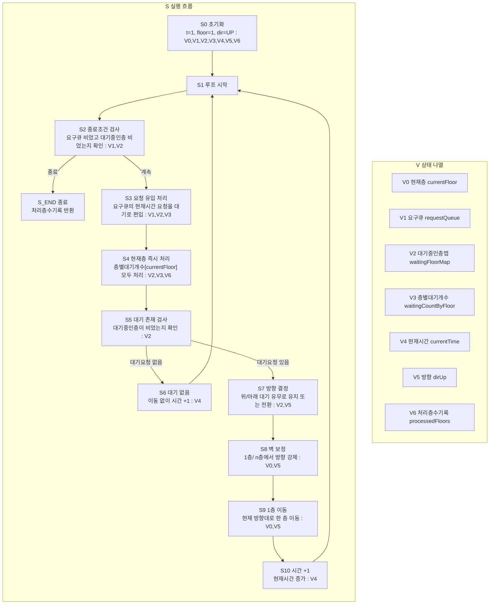

# 엘리베이터 알고리즘 상태 전이 그래프

한 다이어그램 안에서 `S`(흐름)와 `V`(상태)를 분리해서 본다.

## 1) 통합 다이어그램 (S+V)

## 2) V 갱신 규칙 (S 단계 기준)

- `S0`: `V0,V1,V2,V3,V4,V5,V6` 초기화
- `S3`: `V1`에서 현재시간 요청 pop, `V2,V3`에 대기 적재
- `S4`: 현재층 처리로 `V3,V2` 감소/정리, `V6` 기록
- `S6`: `V4` 증가
- `S7`: `V5` 방향 판단
- `S8`: `V5` 벽 보정
- `S9`: `V0` 이동
- `S10`: `V4` 증가

## 직관 요약

흐름은 `S0 -> ... -> S10`으로 고정되어 반복되고,
상태 관리는 `V0~V6` 정의표와 갱신 규칙표로 따로 추적한다.
