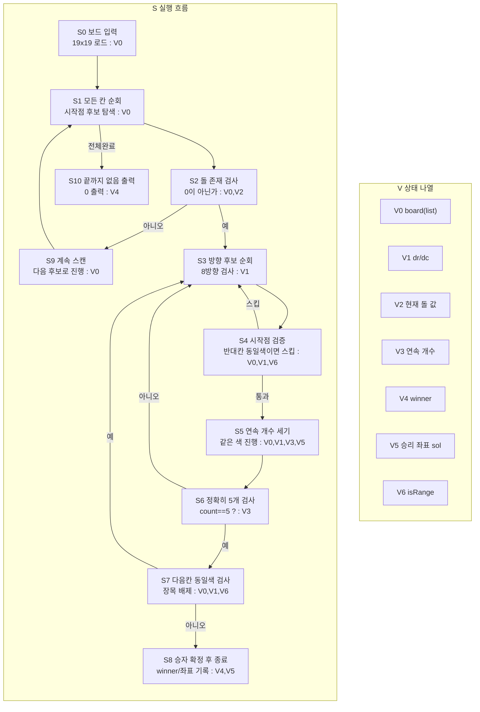

# 오목 알고리즘 상태 전이 그래프

한 다이어그램 안에서 `S`(흐름)와 `V`(상태)를 분리해서 본다.

## 1) 통합 다이어그램 (S+V)

## 2) V 갱신 규칙 (S 단계 기준)

- `S5`: `V3,V5` 연속 라인 갱신
- `S8`: `V4,V5` 승자/좌표 확정
- `S10`: `V4` 기반으로 0 출력

## 직관 요약

흐름은 `후보 스캔 -> 5목 검증 -> 장목 배제`이고,
상태 관리는 `V0~V6` 정의표와 갱신 규칙표로 추적한다.
