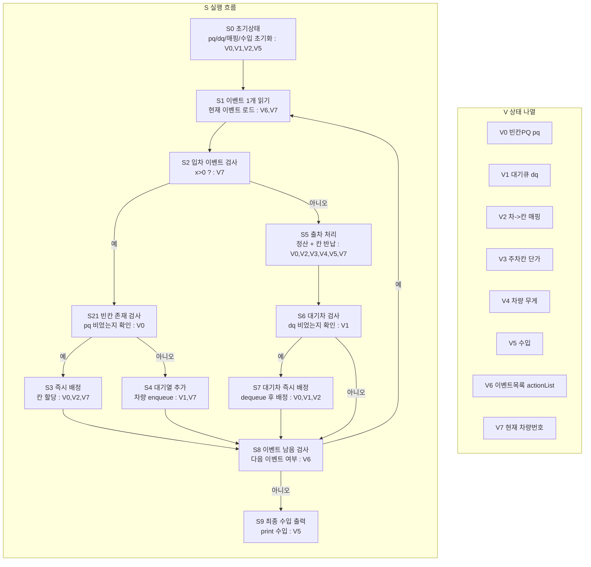

# 주차장 알고리즘 상태 전이 그래프

한 다이어그램 안에서 `S`(흐름)와 `V`(상태)를 분리해서 본다.

## 1) 통합 다이어그램 (S+V)

## 2) V 갱신 규칙 (S 단계 기준)

- `S3`: `V0,V2` 즉시 배정 반영
- `S4`: `V1` 대기열 추가
- `S5`: `V5` 정산 누적, `V0,V2` 출차 반영
- `S7`: `V0,V1,V2` 대기 해소 배정

## 직관 요약

흐름은 이벤트를 순서대로 `입차/출차` 분기 처리하고,
상태 관리는 `V0~V7` 정의표와 갱신 규칙표로 추적한다.
