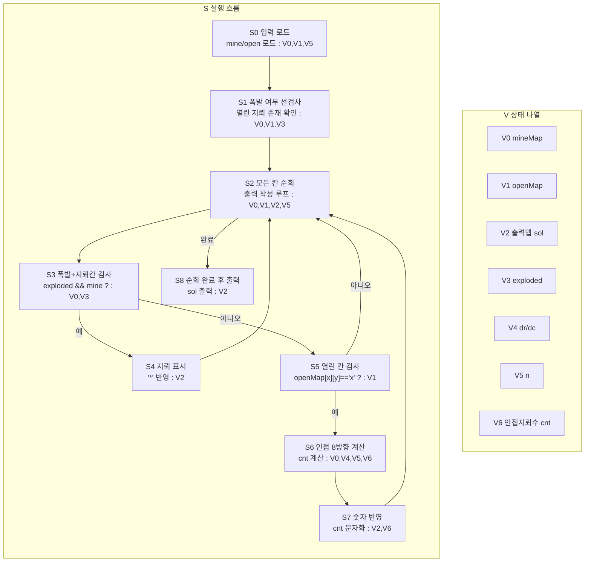

# 지뢰찾기 알고리즘 상태 전이 그래프

한 다이어그램 안에서 `S`(흐름)와 `V`(상태)를 분리해서 본다.

## 1) 통합 다이어그램 (S+V)

## 2) V 갱신 규칙 (S 단계 기준)

- `S1`: `V3` 폭발 여부 확정
- `S4,S7`: `V2` 출력맵 갱신
- `S6`: `V6` 인접 지뢰 수 계산
- `S8`: `V2` 출력

## 직관 요약

흐름은 `폭발 여부 확정 -> 칸별 출력 작성`이고,
상태 관리는 `V0~V6` 정의표와 갱신 규칙표로 추적한다.
