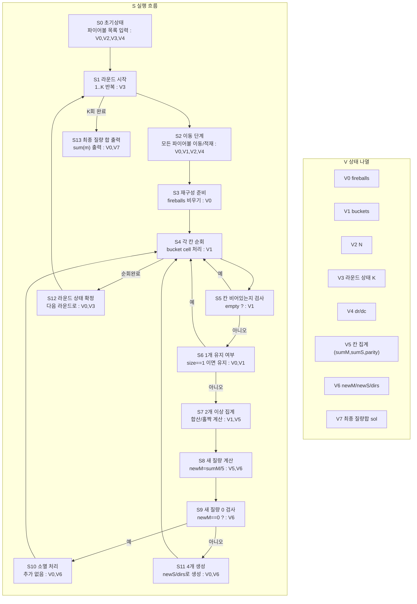

# 파이어볼 알고리즘 상태 전이 그래프

한 다이어그램 안에서 `S`(흐름)와 `V`(상태)를 분리해서 본다.

## 1) 통합 다이어그램 (S+V)

## 2) V 갱신 규칙 (S 단계 기준)

- `S2`: `V1` 이동 결과 적재
- `S3`: `V0` 재구성 시작(clear)
- `S7,S8`: `V5,V6` 집계/파생값 계산
- `S10,S11`: `V0` 소멸/생성 반영
- `S13`: `V7` 계산 후 출력

## 직관 요약

흐름은 `이동 -> 칸별 재구성` 라운드를 반복하고,
상태 관리는 `V0~V7` 정의표와 갱신 규칙표로 추적한다.
