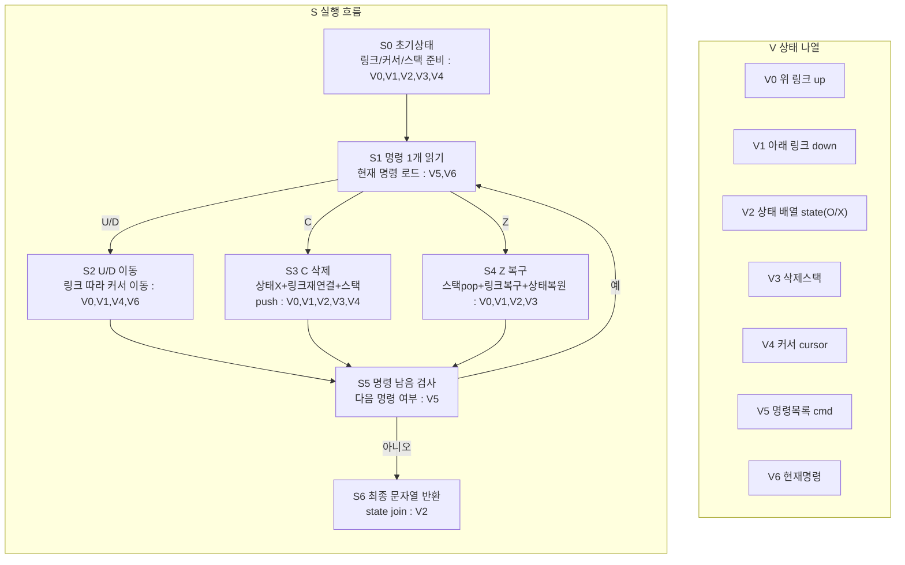

# 표편집 알고리즘 상태 전이 그래프

한 다이어그램 안에서 `S`(흐름)와 `V`(상태)를 분리해서 본다.

## 1) 통합 다이어그램 (S+V)

## 2) V 갱신 규칙 (S 단계 기준)

- `S2`: `V4` 커서 이동
- `S3`: `V0,V1,V2,V3,V4` 삭제 반영
- `S4`: `V0,V1,V2,V3` 복구 반영
- `S6`: `V2` 기반 문자열 반환

## 직관 요약

흐름은 `명령 읽기 -> (이동/삭제/복구) -> 반복`이고,
상태 관리는 `V0~V6` 정의표와 갱신 규칙표로 추적한다.
