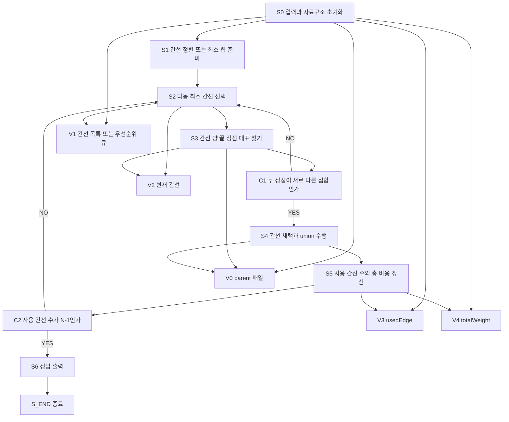

# MST 공통 크루스칼 스키마 모델링

MST 문제에서 반복되는 크루스칼 + 유니온파인드 흐름을 공통 스키마로 정리했다.

```mermaid
graph TB
  A1["S0 입력과 자료구조 초기화"]
  A2["S1 간선 정렬 또는 최소 힙 준비"]
  A3["S2 다음 최소 간선 선택"]
  A4["S3 간선 양 끝 정점 대표 찾기"]
  A5["C1 두 정점이 서로 다른 집합인가"]
  A6["S4 간선 채택과 union 수행"]
  A7["S5 사용 간선 수와 총 비용 갱신"]
  A8["C2 사용 간선 수가 N-1인가"]
  A9["S6 정답 출력"]
  A10["S_END 종료"]

  B1["V0 parent 배열"]
  B2["V1 간선 목록 또는 우선순위 큐"]
  B3["V2 현재 간선"]
  B4["V3 usedEdge"]
  B5["V4 totalWeight"]

  A1 --> A2
  A2 --> A3
  A3 --> A4
  A4 --> A5
  A5 -- "YES" --> A6
  A5 -- "NO" --> A3
  A6 --> A7
  A7 --> A8
  A8 -- "YES" --> A9
  A8 -- "NO" --> A3
  A9 --> A10

  A1 --> B1
  A1 --> B2
  A1 --> B4
  A1 --> B5
  A3 --> B2
  A3 --> B3
  A4 --> B1
  A4 --> B3
  A6 --> B1
  A7 --> B4
  A7 --> B5
```

## 메모

- Mermaid 문법은 `graph TB`와 기본 사각 노드만 사용
- 조건 분기는 `YES/NO` 라벨로 명시
